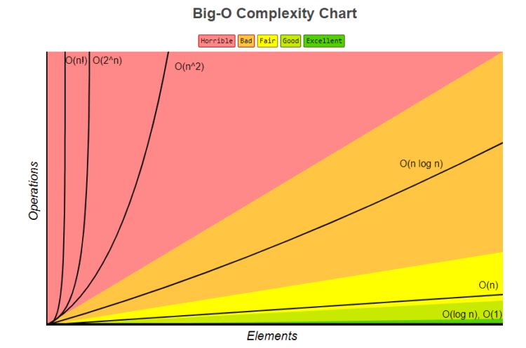

## Local Project:
    + E:\1_CODING\LearnCTDLGT\CTDL-GT
    + https://github.com/Ben-MTP/CTDL-GT

##Cấu trúc dữ liệu + giải thuật
    

##Các giá trị đo cho thuận toán:
    O(n)
    O(n^2)
    O(1)
    O(logN)
    note: độ phức tạp thuật toán là giá trị lớn nhất
    https://www.bigocheatsheet.com/

## Cấu trúc dữ liệu và thuật toán #3: BigO Notation và ví dụ
    Chú ý: Khi tích Big(O) -> luôn tính giá trị lớn max
    Ex1: O(1)
    Ex2: O(N)
    DPT-TT = O^3 + O^2... + 100 -> O(N^3)
    
    + Nếu step + 5 --> khác n + 1.
    Ex3: O(N^2) -> 2 vòng lặp lồng vào nhau.
        f(n) = n*n = n^2, O(f(n)) = O(n^2).
        
        f(n) = n*(n + (n-1) + (n-2) + (n-3) + ... + 3 + 2 + 1)
             = n*((n+1)/2) = n(n+1)/2
             = O(f(n)) = O(n^2)/2.

    
